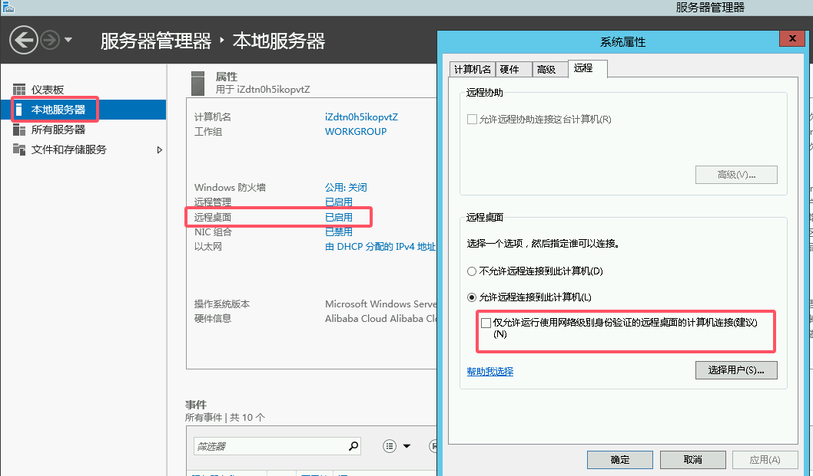
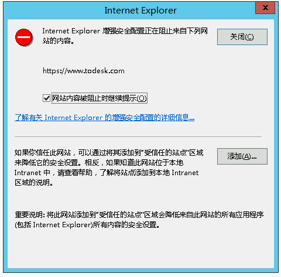
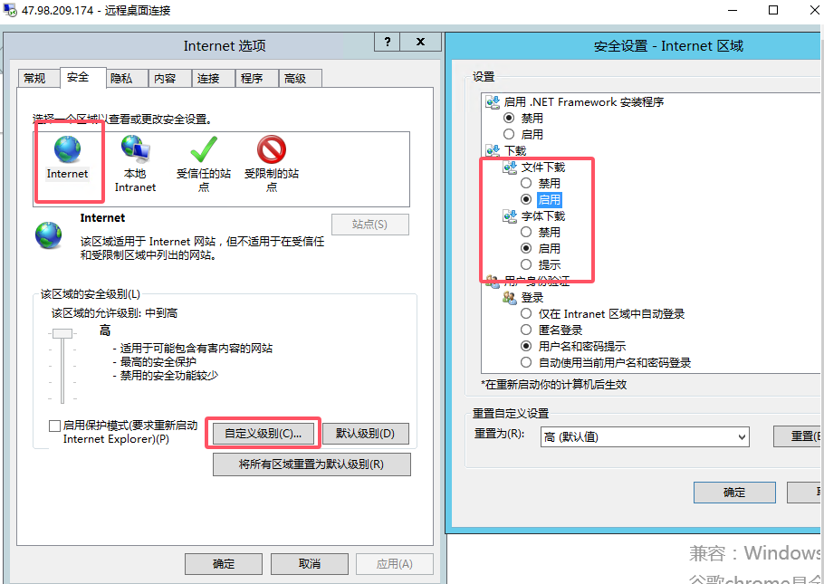
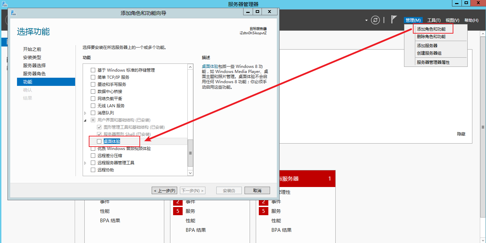

# Win server 2012 R2 标准版

## 远程登录

必须安装 winserver-2012 标准版，配置：

注意取消勾选！！！

接着在自己的windows上打开：远程桌面连接

输入公网 IP 和账号密码即可登录。

默认账号为：Administrator

# web 浏览

打开的所有网站都必须点击添加，加到信任网站中，否则无法正常显示页面。

如果报错当前安全模式无法下载：

# 安装软件

方法一：web浏览下载（不推荐）

方法二：远程桌面连接 点击[此处](https://pan.baidu.com/s/1e-RmSklPME5mYJ4B6HFPeA?pwd=ytmv)下载所需文件

首先在本地下载，然后ctrl+c复制，接着到远程桌面连接的服务器内，ctrl+v粘贴即可。

- NotePad++
- BandZip

下载好雷小伊后，可能会出现两种错误：

## 雷小伊闪退

使用 DirectXRepair4.2.0.40217 修复。

## scheduler闪退

添加 `桌面体验功能` ，然后**重启服务器**，即可修复。

# Todesk

安装todesk，保证桌面常驻。
